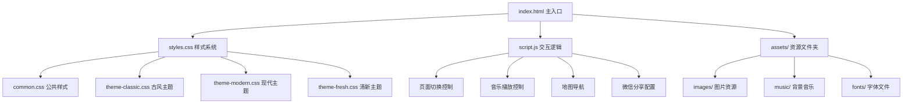

## 产品概述

为王路和张小芳的婚礼创建H5电子请柬，支持微信朋友圈卡片式分享展示，点击后进入完整的多页请柬。

## 核心功能

- **4页式结构**：封面页、邀请函页、电子地图页、结尾页，每页独立展示一张精美图片
- **古风设计**：简洁有诗意的古风风格（水墨画元素、古典配色、书法字体）
- **多模板选择**：提供古风、浪漫现代、简约清新三种风格供用户选择
- **背景音乐**：古风音乐自动播放，支持开关控制
- **页面切换**：优雅的滑动切换动画（上下或左右滑动）
- **电子地图**：集成腾讯/百度地图，支持一键导航到婚礼地点
- **朋友圈优化**：配置Open Graph协议，确保朋友圈显示封面卡片（标题+描述+封面图）
- **响应式设计**：完美适配移动端显示
- **设计建议**：提供封面照片规格、图片处理、素材选择、配色方案等完整设计指南

## 技术栈选择

- **前端框架**：纯HTML5 + CSS3 + JavaScript（原生实现，无需构建工具）
- **页面切换**：Swiper.js（成熟的移动端滑动库）
- **地图集成**：腾讯地图API（国内最佳支持）
- **音频播放**：HTML5 Audio API
- **字体**：Google Fonts（思源宋体、方正书宋等中文古风字体）
- **部署方案**：静态托管（GitHub Pages / Netlify / Vercel）

## 实现方案

### 核心技术决策

1. **纯静态页面**：无需后端，所有资源前端加载，降低部署成本和复杂度
2. **单页应用（SPA）**：使用全屏滑动切换，提供流畅的用户体验
3. **渐进增强**：基础功能保证可用，高级特性（音乐、动画）逐步增强
4. **微信优化**：完整配置Open Graph和微信专用meta标签

### 架构设计

#### 系统架构



#### 模块划分

- **布局模块**：响应式容器、全屏页面、导航指示器
- **主题模块**：三套独立主题样式（古风/现代/清新），支持快速切换
- **交互模块**：Swiper页面切换、音乐控制器、地图跳转
- **分享模块**：Open Graph配置、微信JSSDK集成（可选）

#### 数据流

用户打开页面 → 加载配置（新人信息、婚礼时间地点） → 初始化Swiper → 自动播放背景音乐 → 用户滑动浏览 → 点击地图跳转导航

### 实现细节

#### 性能优化

- **图片优化**：使用WebP格式（fallback到JPG），建议每张图片压缩到300KB以内
- **懒加载**：非首屏图片延迟加载，减少初始加载时间
- **CDN加速**：Swiper.js等第三方库使用CDN（jsDelivr/unpkg）
- **缓存策略**：合理设置静态资源缓存时间（建议7天）

#### 兼容性处理

- **音频自动播放**：微信内置浏览器需要用户交互后才能播放，提供明显的播放按钮引导
- **字体加载**：使用font-display: swap避免字体加载阻塞渲染
- **地图跳转**：优先检测微信环境，使用腾讯地图；其他环境提供多种导航选择

#### 微信分享配置

- **Open Graph标签**：og:title、og:description、og:image、og:url
- **微信专用标签**：确保朋友圈分享显示完整卡片
- **图片要求**：1200×630px，HTTPS链接，<300KB

## 目录结构

### 项目文件组织

```
hunli/
├── index.html                    # [NEW] 主入口文件，配置Open Graph标签，包含完整4页结构（封面/邀请函/地图/结尾）
├── styles/
│   ├── common.css               # [NEW] 公共基础样式，包含reset、响应式布局、字体定义、通用组件样式
│   ├── theme-classic.css        # [NEW] 古风主题样式（水墨背景、古典配色、书法字体效果、中国风装饰元素）
│   ├── theme-modern.css         # [NEW] 浪漫现代主题（渐变色背景、现代字体、简约布局、流行配色）
│   └── theme-fresh.css          # [NEW] 简约清新主题（淡雅配色、极简设计、轻量装饰、清新氛围）
├── scripts/
│   ├── main.js                  # [NEW] 主交互脚本，初始化Swiper、音乐控制、地图跳转、微信分享配置
│   └── config.js                # [NEW] 配置文件，存储新人信息、婚礼时间地点、可由用户修改的变量
├── assets/
│   ├── images/
│   │   ├── cover.jpg            # [NEW] 封面图片（1200×630px，用于朋友圈卡片展示）
│   │   ├── page1.jpg            # [NEW] 封面页背景图
│   │   ├── page2.jpg            # [NEW] 邀请函页背景图
│   │   ├── page3.jpg            # [NEW] 地图页背景图
│   │   └── page4.jpg            # [NEW] 结尾页背景图
│   ├── music/
│   │   └── bgm.mp3              # [NEW] 背景音乐文件（古风音乐，建议3-5分钟循环播放）
│   └── fonts/
│       └── README.md            # [NEW] 字体使用说明，推荐的Google Fonts链接
├── docs/
│   ├── DESIGN_GUIDE.md          # [NEW] 设计指南，包含图片规格、素材推荐、配色方案、字体选择等
│   └── DEPLOYMENT_GUIDE.md      # [NEW] 部署指南，详细说明GitHub Pages/Netlify/Vercel部署步骤及域名配置
└── README.md                     # [NEW] 项目说明文档，包含快速开始、功能介绍、自定义方法、常见问题解答
```

## 关键代码结构

### 配置接口（config.js）

```javascript
// 婚礼配置信息
const weddingConfig = {
  // 新人信息
  groom: string,              // 新郎姓名
  bride: string,              // 新娘姓名
  
  // 婚礼信息
  date: string,               // 婚礼日期（例如：2026年3月15日）
  time: string,               // 婚礼时间（例如：上午10:18）
  location: string,           // 婚礼地点详细地址
  
  // 地图配置
  map: {
    lat: number,              // 纬度
    lng: number,              // 经度
    name: string              // 地点名称
  },
  
  // 主题选择
  theme: 'classic' | 'modern' | 'fresh',  // 默认主题
  
  // 音乐配置
  music: {
    src: string,              // 音乐文件路径
    autoplay: boolean         // 是否自动播放
  }
};
```

### 页面结构接口（index.html）

```html
<!-- Open Graph配置 -->
<meta property="og:title" content="string">
<meta property="og:description" content="string">
<meta property="og:image" content="string">
<meta property="og:url" content="string">

<!-- 页面容器 -->
<div class="swiper-container">
  <div class="swiper-wrapper">
    <div class="swiper-slide page-cover"></div>      <!-- 封面页 -->
    <div class="swiper-slide page-invitation"></div> <!-- 邀请函页 -->
    <div class="swiper-slide page-map"></div>        <!-- 地图页 -->
    <div class="swiper-slide page-ending"></div>     <!-- 结尾页 -->
  </div>
</div>
```

## 设计风格

采用**简洁有诗意的古风风格**作为主推荐方案，同时提供浪漫现代和简约清新两种备选风格。

### 主题一：古风雅韵（推荐）

#### 视觉元素

- **背景**：水墨画渐变效果，淡雅的山水意境，半透明的宣纸质感叠加
- **装饰**：中国风边框、祥云纹样、梅花点缀、印章元素
- **排版**：竖排文字与横排结合，诗词式排版，留白艺术

#### 页面设计

**封面页**

- 顶部：淡雅的祥云装饰
- 中部：竖排显示"王路 ❤️ 张小芳"，使用书法字体
- 下部：横排显示婚礼日期，配以印章图案
- 背景：水墨山水画，朦胧意境

**邀请函页**

- 顶部：古诗词引言（例如："执子之手，与子偕老"）
- 中部：婚礼详细信息，使用古风边框包裹
- 下部：诚挚邀请语，配以梅花装饰
- 背景：宣纸纹理，淡雅色调

**地图页**

- 顶部：地点名称，配以传统建筑图标
- 中部：嵌入式地图窗口，圆形或古典窗格形状
- 下部："一键导航"按钮，古风设计
- 背景：简洁的水墨渲染

**结尾页**

- 中部：感谢语与祝福语，书法字体
- 底部：新人署名，配以印章
- 背景：淡雅的渐变背景，飘落的花瓣动画

#### 交互动效

- 页面切换：竖向滑动，模拟翻阅古籍的感觉
- 文字动画：淡入效果，模拟墨迹晕染
- 装饰元素：飘落的花瓣、流动的祥云

---

### 主题二：浪漫现代（备选）

#### 视觉元素

- **背景**：柔和的渐变色（粉色到紫色），现代摄影风格
- **装饰**：几何图形、光晕效果、简约线条
- **排版**：居中对齐，现代无衬线字体，宽松行距

#### 页面设计

- **封面页**：大幅情侣照片，半透明渐变蒙版，白色文字叠加
- **邀请函页**：卡片式布局，白色半透明容器，清晰的信息层级
- **地图页**：全屏地图，浮动的白色信息卡片
- **结尾页**：浪漫引言，星光点缀效果

#### 交互动效

- 页面切换：横向滑动，流畅的缓动效果
- 元素动画：从下到上淡入，轻微的缩放效果

---

### 主题三：简约清新（备选）

#### 视觉元素

- **背景**：纯色或极简渐变（白色到淡蓝色）
- **装饰**：极简线条、小清新插画、留白设计
- **排版**：左对齐为主，清晰的视觉层级，现代字体

#### 页面设计

- **封面页**：大面积留白，极简文字排版，小清新插画点缀
- **邀请函页**：列表式信息展示，清晰的图标引导
- **地图页**：简洁的地图嵌入，明确的导航按钮
- **结尾页**：简短的感谢语，温馨的小插画

#### 交互动效

- 页面切换：淡入淡出，轻快的过渡效果
- 元素动画：微动画，细腻的hover效果

---

## 响应式设计

- **移动端优先**：针对375px-414px宽度屏幕优化设计
- **竖屏显示**：全屏沉浸式体验，隐藏地址栏
- **触摸优化**：按钮尺寸不小于44×44px，便于点击
- **字体适配**：使用rem单位，根据屏幕宽度自动缩放